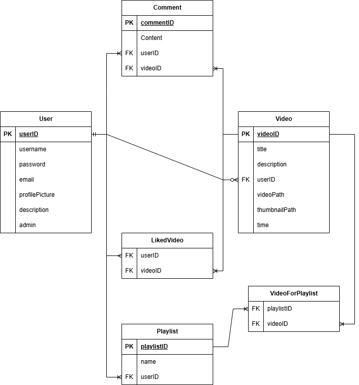
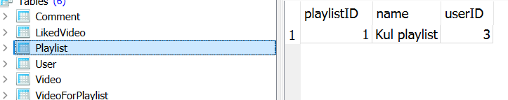
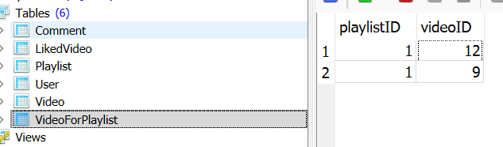

# IkkeYouTube

## Navigasjon

- [Database](#datamodel-og-database)
    - [Datamodell](#datamodel)
    - [Forklaring av database](#forklaring-av-databasen)
- [Teknologi](#teknologi)
    - [Node modules jeg bruker](#node-modules-jeg-bruker)
    - [Eksempel på API-kall](#eksempel-på-api-kall-i-appjs)
    - [Frontend](#frontend)

## Datamodel og Database


### Datamodel
Her er Datamodellen til prosjektet: <br>
Akkuratt nå så er det ingen funksjonalitet for playlists men det er fortsatt en del av database strukturen.


### Forklaring av databasen
I denne databasen så er det noen få koblinger mellom tabellene jeg skal forklare disse koblingene.

#### - **FK** userID -> Video tabell<br>
Her så trenger jeg å ha en bruker id som en del av videoen for å vite hvem det var som lastet den opp.
<br>
<br>

#### - **FK** userID **Og** **FK** videoID -> Comment tabell<br>
For kommentarer så trenger jeg å knytte kommentaren til en person OG en video sånn at ikke alle kommentarene kommer på alle videoene.
<br>
<br>

#### - **FK** userID **Og** **FK** videoID -> LikedVideo tabell <br>
Dette er tabellen for å lagre hvilke videoer en bruker har liket og hvem som har liket en video, denne tabellen har bare de to foreign keys-ene.
<br>
<br>

#### - **FK** userID -> Playlist tabell <br>
Her så har jeg bare userID selv om man ville trodd at jeg også skal ha en video knyttet, men jeg skal forklare det i den neste.
<br>
<br>

#### - **FK** playlistID **Og** **FK** videoID -> VideoForPlaylist tabell <br>
Som du kan se så har jeg **to** tabeller for playlists, dette er på grunn av hvis jeg hadde hatt alt i en tabell så hadde det vært vanskelig å legge til mer en en video i en databse. <br>

For å fikse dette så lager jeg først en playlist knyttet til brukeren som lagde den. **SÅ** kan jeg legge til videoer i VideoForPlaylist tabellen med å knytte de til playlistID der. <br>

Det ville sett ut som dette i databasen



## Teknologi

### Node modules jeg bruker

- **bcrypt** for kyptering av passord
- **better-sqlite3** for å kommunisere med databasen
- **dotenv** for .env filer i dette tilfelle for express session secret
- **express** for rutene inni app.js (alt som har app.post/get/listen/put/delete)
- **express-session** for bruker session
- **multer** for filopplastning til videoer, profilbilder og video thumbnail
- **path** for håndtering av filstier til multer

### Eksempel på API kall i app.js
<details>

<summary>Eksempel 1, hente ut alle videoer</summary>

<br>
Her så henter jeg ut alle videoer for å vise de på hjemmesiden jeg henter ut, videoID, titel, description, thumbnail, videoen, tidspunk den ble laget, IDen,brukernavnet og profilbildet til personen som lagde videoen

```js
    app.get('/videos', requireLogin, (req, res) => {
        try {
            const videos = db.prepare(`
                SELECT Video.videoID, Video.title, Video.description, Video.thumbnailPath, Video.videoPath, Video.time, Video.userID, User.username, User.profilePicture
                FROM Video
                JOIN User ON Video.userID = User.userID
                ORDER BY Video.videoID DESC
            `).all();
            
            return res.json({ error: false, videos });
        } catch (err) {
            return res.status(500).json({ error: true message: 'Server error: ' + err.message });
        }
    });

```
</details>

<br>

<details>
<summary>Eksempel 2, registrere bruker med multer for profilbilde</summary>
<br>
Her så har jeg ruten for registrering av bruker, stor del av den er for å kjekke om brukernavn, passord og epost er gitt til serveren og om de er allerede en del av en annen bruker.
<br>
<br>
På den andre linjen der det står upload.single('profilepicture')... så prøver den å laste noe opp til multer
<br>
<br>
('ProfilePicture') referer til ID-en av filopplastning elementet i register.html
<br>
<br>
Den delen over der "saltrounds" blir satt er håndteringen av filstien og navngiving til profilbilde, den kjører ting lengre oppe i app.js filen, som du kan se under denne kode blokken
<br>
<br>
Jeg setter da bcrypt kryptering på passordet og så legger jeg til, brukernavn, epost, kryptert passord og profilbilde stien inn i databsen

```js
app.post('/register', async (req, res) => {
    upload.single('profilePicture')(req, res, async (err) => {
        try {
            if (err instanceof multer.MulterError) {
                return res.status(400).json({ error: true, message: err.message });
            } else if (err) {
                return res.status(400).json({ error: true, message: err.message });
            }

            const { username, password, email } = req.body;

            if (!username || !password || !email) {
                return res.status(400).json({ error: true, message: 'Username, password, and email are required.' });
            }

            const existingUser = db.prepare('SELECT * FROM User WHERE email = ?').get(email);
            if (existingUser) {
                return res.status(400).json({ error: true, message: 'Email already in use.' });
            }

            if (!req.file) {
                return res.status(400).json({ error: true, message: 'Profile picture is required.' });
            }

            const profilePictureName = req.file ? await saveFileBuffer(req.file.buffer, req.file.originalname, { width: 200, height: 200, prefix: `${username}_profile` }) : null;
            const profilePicture = profilePictureName ? `/multerFiles/${profilePictureName}` : null;

            const saltrounds = 10;
            const hashedPassword = await bcrypt.hash(password, saltrounds);

            const stmt = db.prepare('INSERT INTO User (username, password, email, profilePicture) VALUES (?, ?, ?, ?)');
            stmt.run(username, hashedPassword, email, profilePicture);
            return res.status(201).json({ error: false, message: 'User created successfully.' });
        } catch (err) {
            return res.status(500).json({ error: 'Server error: ' + err.message });
        }
    });
});
```

<details>
<summary>Multerkoden</summary>
<br>
Her så har jeg all koden relatert til multer som er uttenfor ruter i app.js
<br>
<br>
I begynnelsen så setter jeg opp hvor alt skal bli lastet opp til, delen der det står "const fs = require('fs');" så vil den lage mappen selv hvis den ikke fins, dette er viktig siden den mappen blir aldri lastet opp til github.
<br>
<br>
Etter det så er der vi setter storage til memorystorage og instillinger for filene som blir lastet opp, som filstørelse limit og hvilke filextensions
<br>
<br>
Den siste delen (saveFileBuffer) blir referert i alle rutene der jeg gjør filopplastning, den setter filnavn og på slutten der det står "await fs.promises.writeFile(filePath, buffer);" så skriver den ut filen fra minnet og har den som en faktisk fil for å bli vist på siden.

```js

const uploadDir = path.join(__dirname, 'public/multerFiles');
    // Create upload directory if it doesn't exist
const fs = require('fs');
if (!fs.existsSync(uploadDir)) {
    fs.mkdirSync(uploadDir, { recursive: true });
}

const storage = multer.memoryStorage();

const upload = multer({
    storage: storage,
    limits: {
        fileSize: 2 * 1024 * 1024 * 1024  // 2 GB limit
    },
    fileFilter: (req, file, cb) => {
        const allowed = ['video/mp4', 'video/webm', 'video/ogg', 'image/jpeg', 'image/png', 'image/webp'];
        if (allowed.includes(file.mimetype)) {
            cb(null, true);
        } else {
            cb(new Error('Invalid file type. Try a different file.'), false);
        }
    }
});

async function saveFileBuffer(buffer, originalName, opts = {}) {
    const uniqueSuffix = Date.now() + '-' + Math.round(Math.random() * 1E9);
    const ext = path.extname(originalName || '').toLowerCase();

    let filename = `${uniqueSuffix}${ext}`;
    if (opts.prefix) {
        filename = `${opts.prefix}-${filename}`;
    }
    
    // Write the buffer to disk
    const filePath = path.join(uploadDir, filename);
    await fs.promises.writeFile(filePath, buffer);
    
    return filename;
}

```

</details>
</details>

### Frontend

I dette prsjektet så har jeg 6 forskjellige sider
- login.html
- register.html
- home.html
- upload.html
- watch.html
- channel.html

Hver av disse har sin egen javascript fil og css fil (login og register deler en)

Jeg skal vise to eksempel på hvordan jeg gjør ting i frontenden og knytter det til server siden (app.js)

<details>
<summary>Eksempel 1, vise videoene på hjemmesiden</summary>
<br>
Her har jeg kode for å hente ut data fra serveren gjennom /videos og så for å lage et "videoCard" for hver video den finner i databasen, når jeg viser videoCard-et så legger jeg til thumbnailen, titelen på videoen, hvem som lastet den opp og når den ble laget
<br>
<br>
På bunnen så er det også noe for å kjøre function-en som laster inn videoene når siden blir lastet.
<br>
<br>
Dette er ikke hele koden inni home.js det er også noe for å vise profilbilde til personen som er logget inn oppe i høyre gjørne. 

```js
async function loadVideos() {
    try {
        const response = await fetch('/videos');
        const data = await response.json();

        if (data.error) {
            console.error('Error fetching videos:', data.message);
            return;
        }

        const videosContainer = document.querySelector('.videos-container');
        videosContainer.innerHTML = ''; // Clear existing videos

        if (data.videos.length === 0) {
            videosContainer.innerHTML = '<p>No videos uploaded yet.</p>';
            return;
        }

        data.videos.forEach(video => {
            const videoCard = document.createElement('div');
            videoCard.className = 'video-card';
            videoCard.onclick = () => {
                // Navigate to watch page
                window.location.href = `/watch.html?id=${video.videoID}`;
            };

            videoCard.innerHTML = `
                
                <div class="video-info">
                    <div class="video-title" title="${video.title}">${video.title}</div>
                    <div class="video-author">${video.username}</div>
                    <div class="video-timestamp">${new Date(video.time*1000).toLocaleString()}</div>
                </div>
            `;

            videosContainer.appendChild(videoCard);
        });
    } catch (err) {
        console.error('Error loading videos:', err);
    }
}

document.addEventListener('DOMContentLoaded', () => {
    loadVideos();
});

```


</details>

<br>

<details>
<summary>Eksempel 2, Laste opp video med upload.js</summary>
<br>
Her er koden for å laste opp en video til serveren
<br>
<br>
først så henter jeg tittel og description til video-en i tekst, men jeg henter også ut video filen og thumbnail filen.
<br>
<br>
Jeg putter så disse verdiene inn i en formdata (esj) og sender de til serveren gjennom /uploadVideo

```js
async function Upload(event) {
    event.preventDefault();
    const title = document.getElementById('Title').value;
    const description = document.getElementById('Description').value;
    const videoFile = document.getElementById('Video').files[0];
    const thumbnailFile = document.getElementById('Thumbnail').files[0];

    const formData = new FormData();
    formData.append('title', title);
    formData.append('description', description);
    formData.append('video', videoFile);
    formData.append('thumbnail', thumbnailFile);

    const response = await fetch('/uploadVideo', {
        method: 'POST',
        body: formData
    });

    const result = await response.json();
    alert(result.message);
}

const uploadButton = document.getElementById('uploadButton').addEventListener('click', Upload);
```
</details>